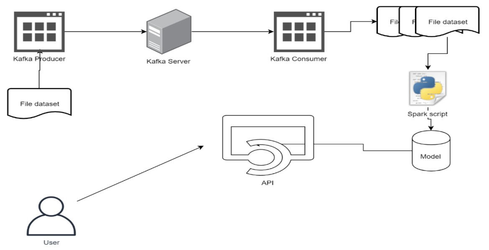

# Project 2: Kafka-Spark  

### Big Data Streaming System for Udemy Course Clustering
### Project Members
| Nama                            | NRP          |
| ------------------------------- | ------------ |
| Marcelinus Alvinanda Chrisantya | `5027221012` |
| Etha Felisya Br Purba           | `5027221017` |
| Fazrul Ahmad Fadhilah           | `5027221025` |

---

## Project Overview
This project implements a Big Data streaming system using **Apache Kafka** and **Apache Spark** to simulate data stream processing and perform clustering on Udemy course data. The aim is to group courses based on specific metrics, such as popularity, difficulty level, and temporal trends.

---

## Dataset
The dataset used contains information about Udemy courses with the following columns:

- **course_id**: Unique identifier for each course.
- **course_title**: Title of the course.
- **url**: Direct link to the course.
- **is_paid**: Indicates if the course is free or paid.
- **price**: Course price (if paid).
- **num_subscribers**: Total number of subscribers.
- **num_reviews**: Number of reviews.
- **num_lectures**: Total lectures in the course.
- **level**: Difficulty level (e.g., Beginner, Intermediate, Expert).
- **content_duration**: Total content duration in hours.
- **published_timestamp**: Date and time of publication.
- **subject**: Main category or subject area (e.g., Business, Technology).

---

## Clustering Models
Three clustering models were developed to group courses based on different features:

### 1. Clustering by Popularity and Engagement
   - **Features**: `num_subscribers`, `num_reviews`, `num_lectures`, `content_duration`
   - **Goal**: To group courses based on their popularity and engagement metrics.
   - **Usage**: Identifies highly popular courses and analyzes factors that make them stand out.

### 2. Clustering by Difficulty Level and Content
   - **Features**: `level`, `num_lectures`, `content_duration`
   - **Goal**: To categorize courses into beginner, intermediate, and advanced groups based on difficulty and content depth.
   - **Usage**: Helps users find courses that match their skill level.

### 3. Clustering by Temporal Trends
   - **Features**: `published_timestamp`, `num_subscribers`, `num_reviews`
   - **Goal**: To understand the popularity trends of courses over time.
   - **Usage**: Reveals insights into trending or declining topics.

---

## Workflow



1. **Docker Setup**  
   - The `docker-compose.yaml` file is used to start Kafka, Zookeeper, and other required services.

2. **Kafka Producer**  
   - The `kafka-producer.py` script in the `kafka-producer` folder reads the dataset (`udemy_courses_dataset.csv`) sequentially and sends data row by row to the Kafka server with random delays to simulate streaming.
   - The dataset is split into three batches (`batch_1.csv`, `batch_2.csv`, `batch_3.csv`), stored in the `dataset/batch-dataset` folder.

3. **Kafka Consumer**  
   - The `kafka-consumer.py` script in the `kafka-consumer` folder reads data from the Kafka server and saves it into batches according to the specified configuration.

4. **Model Training**  
   - The KMeans model is trained using Spark on each data batch.
   - Three notebooks (`model-1.ipynb`, `model-2.ipynb`, `model-3.ipynb`) handle the training process for each batch, saving the resulting models in the `kafka-model` folder:
     - `spark_kmeans_model_a`: Model trained on the first batch.
     - `spark_kmeans_model_b`: Model trained on the second batch.
     - `spark_kmeans_model_c`: Model trained on the third batch.

5. **API Development**  
   - The `api.py` file implements an API to provide endpoints for each clustering model. The endpoints accept user input and return clustering results based on the trained models.

---

## API Endpoints

1. **Endpoint 1: `/course_popularity`**
   - **Description**: Uses features `num_subscribers`, `num_reviews`, `num_lectures`, and `content_duration`.
   - **Example Request**:
     ```bash
     curl -X POST "http://127.0.0.1:5000/course_popularity" -H "Content-Type: application/json" -d '{
       "num_subscribers": "10000",
       "num_reviews": "150",
       "num_lectures": "30",
       "content_duration": "5.0"
     }'
     ```

2. **Endpoint 2: `/course_difficulty`**
   - **Description**: Uses features `num_subscribers`, `num_reviews`, `num_lectures`, and `content_duration`.
   - **Example Request**:
     ```bash
     curl -X POST "http://127.0.0.1:5000/course_difficulty" -H "Content-Type: application/json" -d '{
       "num_subscribers": "5000",
       "num_reviews": "100",
       "num_lectures": "20",
       "content_duration": "2.5"
     }'
     ```

3. **Endpoint 3: `/course_price_analysis`**
   - **Description**: Uses features `price`, `num_subscribers`, `num_reviews`, and `content_duration`.
   - **Example Request**:
     ```bash
     curl -X POST "http://127.0.0.1:5000/course_price_analysis" -H "Content-Type: application/json" -d '{
       "price": "200.0",
       "num_subscribers": "1500",
       "num_reviews": "200",
       "content_duration": "3.5"
     }'
     ```

---

## How to Run the Project

1. **Start Docker Services**  
   - Run the following command to start Kafka and related services:
     ```bash
     docker-compose up -d
     ```

2. **Run Kafka Producer**  
   - Execute `kafka-producer.py` to stream data to Kafka.

3. **Run Kafka Consumer**  
   - Execute `kafka-consumer.py` to read data from Kafka and store it in batches.

4. **Train Models**  
   - Run each notebook (`model-1.ipynb`, `model-2.ipynb`, `model-3.ipynb`) to train models based on each data batch.

5. **Start API Server**  
   - Run `api.py` to start the API server, providing endpoints for each clustering model.

---
